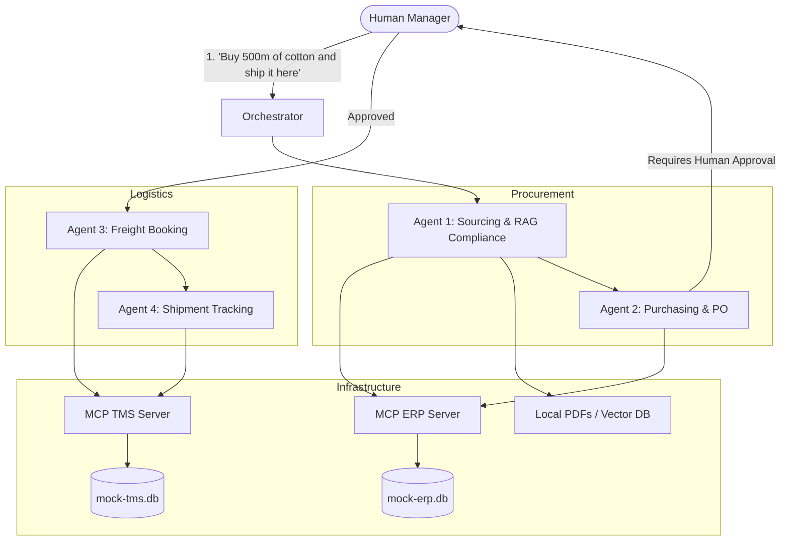

# Balanced Scope Project Plan: Procurement + Logistics (Undergraduate Level)

> [!NOTE]  
> **Scope Strategy:** To fit a 2-month part-time academic timeline while maintaining an end-to-end flow, we are reducing the 8 agents down to **4 core agents**. We keep both Procurement and Logistics, but we eliminate Warehousing and Outbound Sales. 
> 
> **Academic Justification for Mocking:** In your report, you can justify this architecture by stating that real-world Supply Chain APIs (like SAP ERP, project44 for tracking, or Freightos for quoting) are enterprise-gated, highly expensive, and inaccessible for academic research. Therefore, building Mock MCP servers is the most scientifically sound way to test multi-agent orchestration without budget constraints.

## 1. The 4-Agent Pipeline Architecture

We will use **2 Databases** (Mock ERP and Mock TMS) and **4 Agents**, incorporating your RAG chatbot idea for compliance.

### The 4 Agents (End-to-End Flow)
1. **Sourcing & RAG Agent (Procurement):** Searches `mock-erp.db` for suppliers. Instead of a complex performance algorithm, it uses **RAG** to read local PDF supplier contracts to ensure they meet academic/ethical standards before selecting them.
2. **Purchasing Agent (Procurement):** Drafts the Purchase Order (PO) in the ERP and halts the system to ask for **Human Approval**.
3. **Freight Booking Agent (Logistics):** Once the PO is approved, it looks at `mock-tms.db` for simulated carriers (Sea/Air) and "books" the shipment. *(Justification: Real freight quoting APIs cost thousands of dollars).*
4. **Shipment Tracking Agent (Logistics):** Monitors the shipment status. *(Justification: Real GPS tracking APIs are enterprise-only. We simulate ETA changes in the mock DB).*

---

## 2. Two-Month Development Timeline

### Weeks 1-2: The Mock Infrastructure
*   **Databases:** Create `mock-erp.db` (Tables: Suppliers, Purchase_Orders) and `mock-tms.db` (Tables: Carriers, Shipments).
*   **MCP Servers:** Build two simple Python servers. ERP handles `draft_po`. TMS handles `book_shipment` and `update_status`.
*   **RAG Setup:** Create 3 dummy PDF contracts. Set up a basic Vector DB (like Chroma) so an AI can search them.

### Weeks 3-4: The Procurement Agents
*   Build **Agent 1 (Sourcing)**. Connect it to the RAG vector DB and the ERP MCP server. It finds a supplier, checks the PDF to ensure they are ethical, and passes the supplier ID to the next agent.
*   Build **Agent 2 (Purchasing)**. It takes the supplier ID, calls `draft_po`, and returns a message to the user: *"PO drafted. Type 'Approve' to continue."*

### Weeks 5-6: The Logistics Agents
*   Build **Agent 3 (Freight Booking)**. It triggers only after approval. It reads the PO, calls `get_carriers` from the TMS, picks the cheapest, and calls `book_shipment`.
*   Build **Agent 4 (Tracking)**. A simple agent that occasionally checks `get_shipment_status`. *Bonus:* If you have time, connect this agent to a **free** weather API (like OpenWeatherMap). If there is a storm at the origin port, the agent updates the TMS database to say "Delayed".

### Weeks 7-8: Orchestration, Testing & Final Report
*   Use a lightweight framework (like LangChain's LangGraph) to link the 4 agents together into one continuous script.
*   Write your academic report. Emphasize that the **limitations of expensive real-world APIs** dictated the use of MCP Mock Servers, which actually proves a highly modular, decoupled software design.
*   Prepare your demo: Show a single prompt flowing through Sourcing -> RAG Check -> PO Draft -> Human Approval -> Freight Booking.

---

## 3. Why this is perfect for an Undergraduate Project

*   **Shows Breadth:** You touch the two most critical halves of supply chain (Buying it, and Moving it).
*   **Technically Impressive:** You are combining standard Database CRUD operations (via MCP) with unstructured Data querying (via RAG).
*   **Highly Manageable:** You only have 4 database tables total and 4 agents. This leaves you plenty of time to debug and write a high-quality academic paper.
