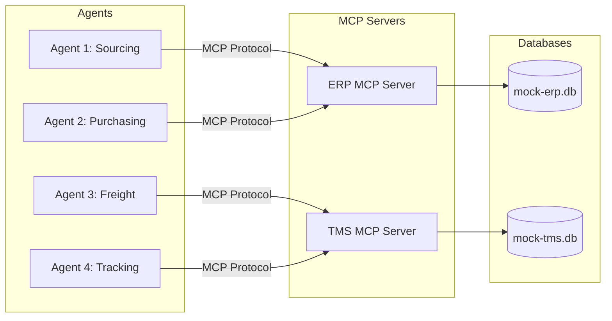

# Model Context Protocol (MCP) Architecture & Tools

Based on the Balanced Scope Project Plan and User Stories, this document defines the exact architecture for the two Mock MCP Servers (ERP and TMS) and the specific tools they will expose to the agents.

## 1. High-Level MCP Architecture

The system utilizes two distinct Mock MCP servers to decouple the databases from the LLM agents. This mimics real-world enterprise architectures where systems like SAP (ERP) and project44 (TMS) are walled off behind strict APIs.

---

## 2. ERP MCP Server Tools (Procurement)

This server interacts strictly with the `mock-erp.db` (Tables: `suppliers`, `purchase_orders`).

### Tool 1: `search_suppliers`
*   **Description:** Searches the ERP database for suppliers who provide a specific material.
*   **Used By:** Agent 1 (Sourcing)
*   **Input Parameters:** 
    *   `material_name` (string): The material required (e.g., "Cotton").
*   **Returns:** A list of JSON objects containing `supplier_id`, `name`, `lead_time_days`, and `unit_price` (simulated).

### Tool 2: `draft_po`
*   **Description:** Creates a new Purchase Order in the ERP with a status of 'Pending'.
*   **Used By:** Agent 2 (Purchasing)
*   **Input Parameters:**
    *   `supplier_id` (integer): ID of the chosen supplier.
    *   `material_name` (string): The material being purchased.
    *   `quantity` (float): Amount required.
*   **Returns:** A JSON object containing the newly created `po_id`.

### Tool 3: `approve_po`
*   **Description:** Updates a Purchase Order's status from 'Pending' to 'Approved'. This is triggered *only* after human-in-the-loop consent.
*   **Used By:** Agent 2 (Purchasing)
*   **Input Parameters:**
    *   `po_id` (integer): ID of the drafted PO.
*   **Returns:** Confirmation message.

---

## 3. TMS MCP Server Tools (Logistics)

This server interacts strictly with the `mock-tms.db` (Tables: `carriers`, `shipments`).

### Tool 4: `get_carriers`
*   **Description:** Retrieves a list of available freight carriers and their transport modes (Sea/Air).
*   **Used By:** Agent 3 (Freight Booking)
*   **Input Parameters:** None (or optionally destination/origin).
*   **Returns:** List of JSON objects containing `carrier_id`, `name`, `mode`, and `rate_per_unit`.

### Tool 5: `book_shipment`
*   **Description:** Officially books a shipment for an approved PO, creating a record in the TMS database.
*   **Used By:** Agent 3 (Freight Booking)
*   **Input Parameters:**
    *   `po_id` (integer): Reference to the approved Purchase Order.
    *   `carrier_id` (integer): The selected carrier.
    *   `mode` (string): "Sea" or "Air".
*   **Returns:** A JSON object containing the `shipment_id` and initial `status` ("Booked").

### Tool 6: `get_shipment_status`
*   **Description:** Retrieves the current tracking status and ETA of an active shipment.
*   **Used By:** Agent 4 (Tracking)
*   **Input Parameters:**
    *   `shipment_id` (integer): The ID of the shipment to track.
*   **Returns:** A JSON object containing `status` (e.g., "In Transit", "Delayed") and `eta`.

### Tool 7: `update_shipment_status`
*   **Description:** Updates the status of a shipment. Used for simulating exception handling (like weather delays).
*   **Used By:** Agent 4 (Tracking)
*   **Input Parameters:**
    *   `shipment_id` (integer): The shipment to update.
    *   `new_status` (string): The new status (e.g., "Delayed").
*   **Returns:** Confirmation message.

---

## 4. Note on RAG & Compliance
The RAG capabilities (parsing PDF supplier contracts) will **not** be an MCP tool. Instead, it will be a local tool/function given specifically to Agent 1. This keeps the MCP boundaries strictly related to structured Database transactions (ERP/TMS), while unstructured AI processing remains at the Agent layer.
