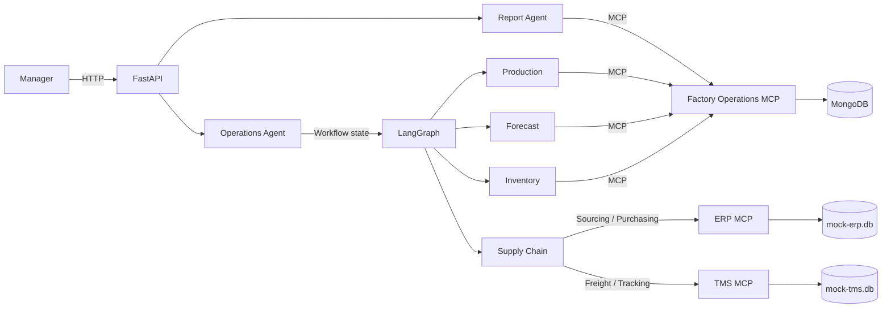

# Model Context Protocol (MCP) Architecture & Tools

OMNI uses three MCP boundaries. The Factory Operations server exposes internal inventory, forecasting, production, and reporting capabilities. The ERP and TMS servers represent external enterprise systems used by the supply-chain workflow.

## 1. High-Level MCP Architecture

LangGraph controls routing and workflow state. MCP supplies controlled tool interfaces for operational data and actions.



---

## 2. Factory Operations MCP Server

The Factory Operations server is implemented in `backend/mcp/factory_operations/server.py`. The local application uses FastMCP's in-memory transport so tool calls do not start a new subprocess on every request. The same server can be started over stdio for an external MCP client:

```powershell
python -m backend.mcp.factory_operations.server
```

Published tool groups:

- **Inventory:** list and classify stock, find a material, calculate shortages, calculate reorder requirements, add a material, and return inventory KPIs.
- **Forecast:** list forecastable products, validate demand data, forecast one product, and forecast all usable products.
- **Production:** list lines and orders, calculate utilization and bottlenecks, retrieve a bill of materials, assess feasibility, and return production KPIs.
- **Reports:** generate a read-only, evidence-grounded management report.

The synchronous facade in `backend/mcp/factory_operations/client.py` preserves the function signatures used by FastAPI and LangGraph while ensuring each operation is invoked as an MCP tool.

---

## 3. ERP MCP Server Tools (Procurement)

This server interacts strictly with the `mock-erp.db` (Tables: `suppliers`, `purchase_orders`).

### Tool 1: `search_suppliers`
*   **Description:** Searches the ERP database for suppliers who provide a specific material.
*   **Used By:** Agent 1 (Sourcing)
*   **Input Parameters:** 
    *   `material_name` (string): The material required (e.g., "Cotton").
*   **Returns:** A list of JSON objects containing `supplier_id`, `name`, `lead_time_days`, and `unit_price` (simulated).

### Tool 2: `draft_po`
*   **Description:** Creates a new Purchase Order in the ERP with a status of 'Pending'.
*   **Used By:** Agent 2 (Purchasing)
*   **Input Parameters:**
    *   `supplier_id` (integer): ID of the chosen supplier.
    *   `material_name` (string): The material being purchased.
    *   `quantity` (float): Amount required.
*   **Returns:** A JSON object containing the newly created `po_id`.

### Tool 3: `approve_po`
*   **Description:** Updates a Purchase Order's status from 'Pending' to 'Approved'. This is triggered *only* after human-in-the-loop consent.
*   **Used By:** Agent 2 (Purchasing)
*   **Input Parameters:**
    *   `po_id` (integer): ID of the drafted PO.
*   **Returns:** Confirmation message.

---

## 4. TMS MCP Server Tools (Logistics)

This server interacts strictly with the `mock-tms.db` (Tables: `carriers`, `shipments`).

### Tool 4: `get_carriers`
*   **Description:** Retrieves a list of available freight carriers and their transport modes (Sea/Air).
*   **Used By:** Agent 3 (Freight Booking)
*   **Input Parameters:** None (or optionally destination/origin).
*   **Returns:** List of JSON objects containing `carrier_id`, `name`, `mode`, and `rate_per_unit`.

### Tool 5: `book_shipment`
*   **Description:** Officially books a shipment for an approved PO, creating a record in the TMS database.
*   **Used By:** Agent 3 (Freight Booking)
*   **Input Parameters:**
    *   `po_id` (integer): Reference to the approved Purchase Order.
    *   `carrier_id` (integer): The selected carrier.
    *   `mode` (string): "Sea" or "Air".
*   **Returns:** A JSON object containing the `shipment_id` and initial `status` ("Booked").

### Tool 6: `get_shipment_status`
*   **Description:** Retrieves the current tracking status and ETA of an active shipment.
*   **Used By:** Agent 4 (Tracking)
*   **Input Parameters:**
    *   `shipment_id` (integer): The ID of the shipment to track.
*   **Returns:** A JSON object containing `status` (e.g., "In Transit", "Delayed") and `eta`.

### Tool 7: `update_shipment_status`
*   **Description:** Updates the status of a shipment. Used for simulating exception handling (like weather delays).
*   **Used By:** Agent 4 (Tracking)
*   **Input Parameters:**
    *   `shipment_id` (integer): The shipment to update.
    *   `new_status` (string): The new status (e.g., "Delayed").
*   **Returns:** Confirmation message.

---

## 5. Note on RAG & Compliance
The RAG capabilities (parsing PDF supplier contracts) will **not** be an MCP tool. Instead, it will be a local tool/function given specifically to Agent 1. This keeps the MCP boundaries strictly related to structured Database transactions (ERP/TMS), while unstructured AI processing remains at the Agent layer.
